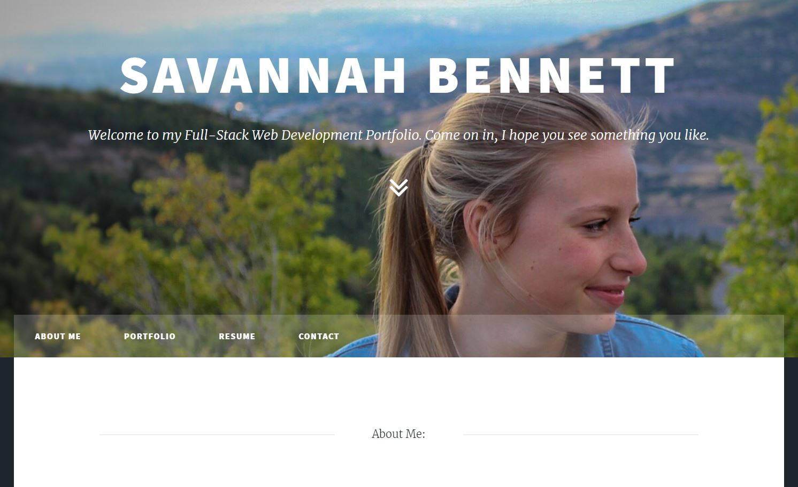

# React Portfolio

## Description
This is my web development portfolio to highlight the coding projects I have worked on, my influence in the job market, and some other information about what makes me the great ME that I am!

## Table of Contents
[Installation](https://github.com/savbennett8/myportfolio-savannahb#installation)
 
[Usage](https://github.com/savbennett8/myportfolio-savannahb#usage)
 
[License](https://github.com/savbennett8/myportfolio-savannahb#license)
 
[Contributing](https://github.com/savbennett8/myportfolio-savannahb#contributing)
 
[Questions](https://github.com/savbennett8/myportfolio-savannahb#questions)

### Installation
This project uses the following libraries:
* React
* Github Pages

### Usage
Click [here](https://savbennett8.github.io/myportfolio-savannahb/) to take a look at my portfolio page!

### License
This project is licensed under the terms of the MIT license. Click [here](https://opensource.org/licenses/MIT) to view information about this license.

### Contributing
Since this is my personal portfolio, I am going to turn away code-contributions, but I am welcome to suggestions of how I could make it better!

### Questions
Check out my [GitHub profile](https://github.com/savbennett8)! If you have any questions, feel free to [email me](mailto:savvy.bennett8@gmail.com).
